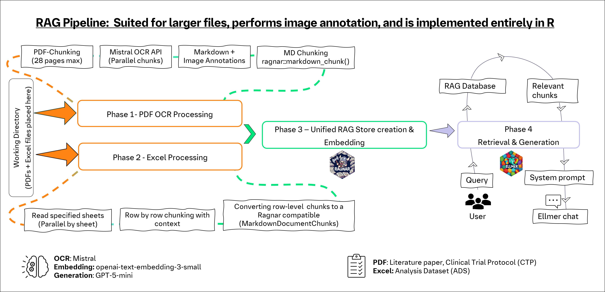

# RAG Pipeline for PDF & Excel files

A unified Retrieval-Augmented Generation (RAG) pipeline in R that processes **PDF** and **Excel** files into a searchable vector database. PDFs are converted to markdown via Mistral OCR (with image annotation), and Excel files are chunked row-by-row. All chunks are embedded and stored in a DuckDB-backed vector store for semantic retrieval using an LLM.

###  setup in RStudio Pro

R version 4.5.0

**Core:** Use **Large** for big files (many PDFs, large Excel sheets). **Standard** may suffice for smaller workloads depending on file size.

-----------------------

## Pipeline Architechture

<p align="center">



</p>

## Requirements & Setup

### 1. API Credentials

You need API keys for **two services**:

| Service | Purpose | 
|---------|---------|
| **Mistral AI** | OCR (PDF → markdown) | 
| **OpenAI** | Embeddings + LLM chat | 


Open the `.Renviron` file using the `{usethis}` package:

```r
usethis::edit_r_environ()
```

Set the following environment variables in the file that opens:

```
MISTRAL_API_KEY=your_mistral_api_key_here
MISTRAL_BASE_URL=https://api.mistral.ai/v1
OPENAI_API_KEY=your_openai_api_key_here
OPENAI_BASE_URL=https://api.openai.com/v1
OPENAI_CHAT_MODEL=gpt-5-mini
```

**Save the `.Renviron` file** and restart your R session for the changes to take effect.

---

### 2. Working Directory

Place `RAG_pipeline.R` in your project folder. Set this folder as your working directory:

```r
setwd("C:/path/to/your/project/folder")
```

 **Important:** All PDF, Excel, and document files you want to process **must be present in this same working directory**. The pipeline automatically discovers `.pdf`, `.xlsx`, `.xlsm`, and `.xls` files from the working directory.


### 3. Package Installation

Uncomment and run the installation block at the top of the script, or run manually:

```r
install.packages(c(
  "base64enc",
  "pdftools",
  "DBI",
  "duckdb",
  "future",
  "future.apply",
  "progressr",
  "readxl",
  "stringr",
  "usethis",
  "ellmer",
   "httr",
  "ragnar"
))

```

After installation, verify all libraries load without errors by running the `library()` calls at the top of the script:

```r
library(httr2)
library(base64enc)
library(pdftools)
library(ragnar)
library(DBI)
library(duckdb)
library(future)
library(future.apply)
library(progressr)
library(readxl)
library(stringr)
```

Once the configuration section runs, it will scan the working directory and print the number of PDF and Excel files found.

---

### 4. Key Configuration Parameters

Before running the pipeline, adjust these two important settings near the top of the script:

#### CPU / Parallel Workers

It detect how many CPU cores are available on your system and capped at the recommended upper limit. you can override this manually if needed.

This controls how many parallel workers are used for PDF OCR processing and Excel sheet processing.

#### Excel Sheet Selection

```r
# Process specific sheets only:
desired_sheets <- c('sheet1', 'sheet2')

# Or set to NULL to process ALL sheets in the Excel file:
desired_sheets <- NULL
```

If your Excel file has multiple sheets, you can specify which ones to process. Set to `NULL` to process every sheet.

---

## Running the Pipeline — Section by Section

Run each section **sequentially** from top to bottom. Sections 1–4 define functions. Sections 5–9 execute the pipeline.

---

### Section 1: PDF Chunking

Defines `prepare_pdf_chunks()`. This function splits large PDFs into chunks of up to **28 pages** each (the Mistral OCR API limit per call). If a PDF has fewer than 28 pages, the original file is used as-is. Larger PDFs are split into temporary sub-files with tracked page ranges.

---

### Section 2: Encoding & Markdown Utilities

Defines three helper functions:

- **`encode_document()`** — Encodes a PDF file to Base64 for API submission.
- **`replace_images_in_markdown_annotated()`** — Replaces `` placeholders in OCR-generated markdown with their textual annotation descriptions.
- **`get_combined_markdown_annotated()`** — Assembles page-level markdown from the OCR response into a complete document, substituting image references with annotations.

---

### Section 3: OCR API Processing

Defines `process_chunk()` which sends a Base64-encoded PDF chunk to the **Mistral OCR API** and returns structured JSON containing:

- Extracted markdown text per page
- Image annotations (`document_type`, `short_description`, `summary`)
- HTML-formatted tables

 **Customizing image descriptions:** You can modify the `description` fields inside the `bbox_annotation_format` schema in `process_chunk()` to control how images are annotated. For example, change `"Summarize the image."` to `"Provide a detailed description of the figure."` for more specific output.

---

### Section 4: Excel Processing Functions

Defines functions for processing Excel files (e.g., ADS plans):

- **`process_ads_excel_file()`** — Reads specified sheets, validates required columns (`Variable Name`, `Variable Label`, `Source / Derivation`), and converts each row into a structured text chunk with a hierarchical context path (e.g., `ADS Plan > ADPC > Variable: STUDYID`).
- **`process_single_sheet()`** — Processes a single sheet independently, designed for parallel execution inside workers.
- **`chunks_to_df()`** — Converts the list of chunk records to a data frame for RAG store insertion.

---

### Section 5: Main OCR Processing Pipeline (PDFs)

**Execution section.** Iterates over all discovered PDF files:

1. Splits each PDF into chunks (≤ 28 pages each)
2. Processes chunks **in parallel** via the Mistral OCR API (controlled by the `cpu` variable)
3. Combines results in page order
4. Saves the final markdown to `*_output.md` files in the working directory

---

### Section 6: Excel Processing Pipeline

**Execution section.** Iterates over all discovered Excel files:

1. Discovers available sheets and filters by `desired_sheets`
2. Processes sheets **in parallel** — one worker per sheet (controlled by the `cpu` variable)
3. Combines row-level chunks from all sheets with context metadata
4. Computes character positions for each chunk within the full concatenated document

---

### Section 7: Unified RAG Store Creation & Embedding

Creates a single DuckDB-backed vector store (`rag_store.duckdb`) and inserts chunks from both sources:

- **PDF insert loop:** Chunks the OCR markdown using `ragnar::markdown_chunk()`, deduplicates, and inserts with embeddings.
- **Excel insert loop:** Converts row-level chunks to a Ragnar-compatible format (`MarkdownDocumentChunks`), deduplicates, and inserts with embeddings.

 If you only have PDFs or only Excel files, the other loop is simply skipped — no changes needed.

**Note:** This step can take significant time depending on the number of chunks, as each chunk must be embedded via the API before insertion into the database.

---

### Section 8: Database Inspection (Optional)

A commented-out section for verifying the database structure and contents. Uncomment and run to inspect:

```r
con <- DBI::dbConnect(duckdb::duckdb(), dbdir = RAG_DATABASE,
                      read_only = TRUE, array = "matrix")
tables <- dbListTables(con)
cat("Tables:", paste(tables, collapse = ", "), "\n")
chunks_tbl <- dbReadTable(con, "chunks")
cat("\nDocuments in database:\n")
print(table(chunks_tbl$origin))
cat("\nTotal chunks:", nrow(chunks_tbl), "\n")
dbDisconnect(con, shutdown = TRUE)
```

This helps you understand how many chunks were created per file and verify that documents were indexed correctly.

---

### Section 9: Semantic Retrieval Queries

The final section connects to the built RAG store and sets up an LLM-powered chat interface:

1. **System prompt** — A strict, citation-enforcing prompt that ensures the LLM answers **only** from retrieved RAG content. It requires file name + page citations for every answer. You can customize this prompt to suit your use case.
2. **Chat object** — Created via `ellmer::chat_openai()` connected to the LLM endpoint.
3. **RAG tool registration** — `ragnar_register_tool_retrieve()` allows the LLM to automatically search the vector store when answering.
4. **Querying** — Use `chat_obj$chat("your question here")` to ask questions.

**Example queries:**

```r
# PDF-based queries
chat_obj$chat("Ask your question here")

```

---

## ️ Troubleshooting

### Issue 1: Package Dependencies

Ensure all packages meet the required versions. If you encounter errors during `library()` calls, reinstall the problematic package. the versions i used for this pipeline

| Package | Required Version | 
|---------|-----------------|
| `ellmer` | `0.3.1` | 
| `ragnar` | `0.2.0` |
| `httr` | `1.2.1` | 
| `Duckdb` | `1.3.1` | 
| `DBI` | `1.2.3` | 
| `future` | `1.49.0` | 
| `future.apply` | `1.11.3` | 
| `pdftools` | `3.5.0` | 
| `htbase64enctr` | `0.1.3` | 

---

### Issue 2: API Status Codes

If the pipeline returns an API error, check the HTTP status code:

| Status Code | Meaning | Common Cause & Fix |
|-------------|---------|-------------------|
| **200** | Success | Request completed successfully |
| **400** | Bad Request | Invalid payload structure or parameters — check PDF encoding |
| **401** | Unauthorized | **Most common issue.** Invalid or expired API key. Verify `MISTRAL_API_KEY` and `OPENAI_API_KEY` in `.Renviron`, save the file, and **restart R** |
| **413** | Payload Too Large | PDF chunk exceeds size limit — reduce `MAX_PAGES_PER_CHUNK` (default: 28) |
| **429** | Rate Limited | Too many requests — wait and retry, or check your API plan limits |
| **500** | Server Error | API server-side issue — retry after a few minutes |
| **504** | Timeout | Request took too long — try smaller chunks or check network |


 **Most frequent error:** `401 Unauthorized` — This almost always means the API credentials are wrong or not loaded. Double-check your `.Renviron` file, ensure there are no trailing spaces, and restart R completely.


**Checking which service failed:**
- If the error occurs during **PDF OCR** (Sections 5) → check `MISTRAL_API_KEY`
- If the error occurs during **embedding** (Section 7) → check `OPENAI_API_KEY`
- If the error occurs during **chat/retrieval** (Section 9) → check `OPENAI_API_KEY` and `OPENAI_CHAT_MODEL`
---

##  Project Structure

```
your-working-directory/
├── RAG_pipeline.R            # Main pipeline script
├── document1.pdf             # Input PDF file(s)
├── document2.pdf
├── Excel_file.xlsx             # Input Excel file(s)
├── document1_output.md       # Generated markdown (after PDF OCR)
├── document2_output.md
├── rag_store.duckdb          # Generated RAG vector database
└── README.md                 # This file
```

---


## Notes

- The pipeline **overwrites** `rag_store.duckdb` on each run (`overwrite = TRUE`) to avoid stale data.
- Parallel processing speed depends on the `cpu` setting and your machine's available cores.
- **API costs:** Both Mistral OCR and OpenAI embeddings/chat are paid APIs. Monitor your usage on their respective dashboards.
- The embedding model used is `text-embedding-3-small` (OpenAI). You can change this in the `embed_function()` definition.
- The system prompt in Section 9 is tested for strict RAG-grounded answers — modify with care.
- The `top_k = 2L` parameter in `ragnar_register_tool_retrieve()` can be adjusted to retrieve more or fewer passages per query.
- To use an **OpenAI-compatible provider** (Azure OpenAI, Ollama, vLLM, etc.), set `OPENAI_BASE_URL` to that provider's endpoint.

-----

# Future Work: Pipeline Optimization

To further improve the speed, scalability, and robustness of the pipeline

#### Precomputational Embedding

- Precompute embeddings before running the main pipeline. It **Reduces overall runtime**, especially on large datasets.

#### Metadata Filtering

- metadata-filtering stage to exclude irrelevant/low-quality data. It **Improves downstream accuracy** by restricting to relevant inputs.

----
Thank you! If you have any doubts or need further assistance, please feel free to reach out.
